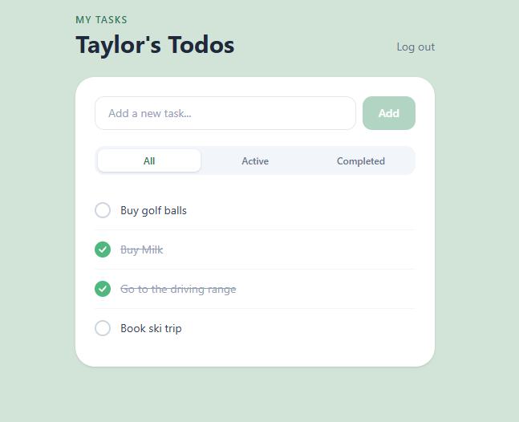
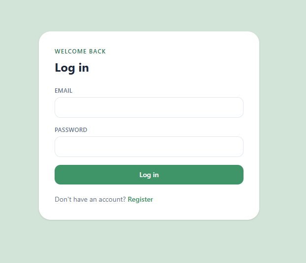

# Taska

A full-stack todo app built with Vue 3 and Laravel. Built to develop fluency in the stack with a focus on architecture patterns: clean separation between API and SPA, typed API layers, composable-driven state management, and tests written alongside features. Deliberately avoids scaffolding tools like Breeze or Inertia to understand how the pieces connect.



---

## Stack

**Backend**
- Laravel 13 (PHP 8.3), API-only, no Blade views
- PostgreSQL
- Laravel Sanctum, SPA cookie auth (httpOnly, CSRF-protected)
- Eloquent ORM with Form Requests for validation and API Resources for response shaping
- Pest for feature testing

**Frontend**
- Vue 3 with Composition API (`<script setup>`)
- TypeScript throughout
- Pinia for auth state
- TanStack Query for server state (queries, mutations, cache invalidation)
- VeeValidate + Zod for schema-driven form validation
- Tailwind CSS v4 with a custom design token
- Vitest + Vue Test Utils for unit testing

---

## Features

- Register, login, logout via Sanctum session cookies
- Create, complete, and delete todos
- Inline edit todo titles (click to edit, Enter to save, Escape to cancel, optimistic update with rollback on error)
- Drag to reorder todos (All filter only, optimistic update with rollback on error)
- Filter by All / Active / Completed
- Per-user data isolation (users only see their own todos)
- Per-item loading states on toggle and delete
- Session persists on page refresh



---

## Architecture

Laravel serves a pure JSON API. Vue is a separate SPA that talks to it over HTTP via Axios with `withCredentials: true`. They share no code and could be deployed independently.

```
browser
  └── Vue SPA (Vite)
        └── Axios (withCredentials: true)
              └── Laravel API
                    └── PostgreSQL
```

Server state lives entirely in TanStack Query; components never fetch directly. The Pinia auth store holds only the current user object, populated on login and cleared on logout. Composables (`useTodos`, `useTodoFilter`, `useLogin`, etc.) encapsulate all business logic and keep components thin.

---

## Project Structure

```
vue-laravel-todo/
├── backend/                     # Laravel 13
│   ├── app/Http/Controllers/    # AuthController, TodoController
│   ├── app/Http/Requests/       # StoreTodoRequest, UpdateTodoRequest
│   ├── app/Http/Resources/      # TodoResource, UserResource
│   ├── app/Models/              # User, Todo
│   └── tests/Feature/           # AuthTest, TodoTest (21 Pest tests)
└── frontend/                    # Vue 3 + Vite
    └── src/
        ├── features/
        │   ├── auth/            # api, types, composables, components
        │   └── todos/           # api, types, composables, components
        ├── stores/              # Pinia auth store
        ├── router/              # Vue Router with auth guard
        └── lib/                 # Axios instance
```

---

## Local Setup

**Prerequisites:** PHP 8.3, Composer, Node 20+, PostgreSQL

**Backend**

```bash
cd backend
composer install
cp .env.example .env
php artisan key:generate
```

Update `.env` with your PostgreSQL credentials:

```
DB_CONNECTION=pgsql
DB_DATABASE=taska
DB_USERNAME=your_user
DB_PASSWORD=your_password
```

```bash
php artisan migrate
php artisan serve
```

API runs on `http://localhost:8000`.

**Frontend**

```bash
cd frontend
npm install
npm run dev
```

App runs on `http://localhost:5173`.

---

## Tests

**Backend (Pest)**
```bash
cd backend
./vendor/bin/pest
```

**Frontend (Vitest)**
```bash
cd frontend
npx vitest run
```
